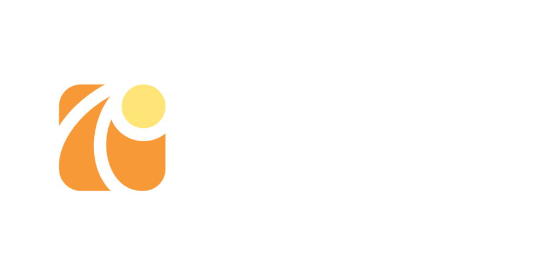
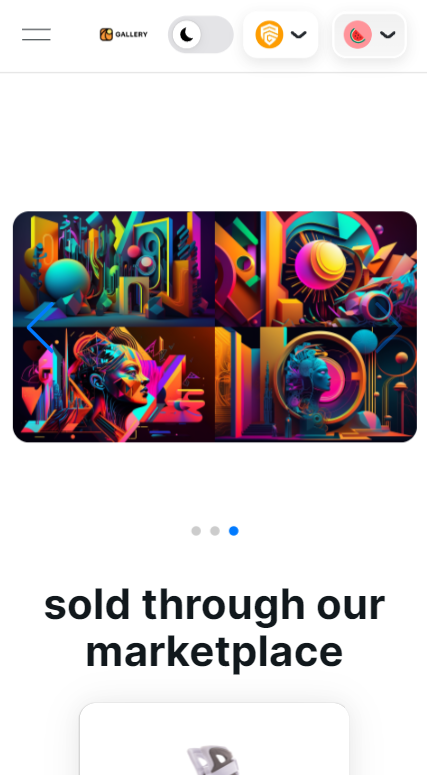
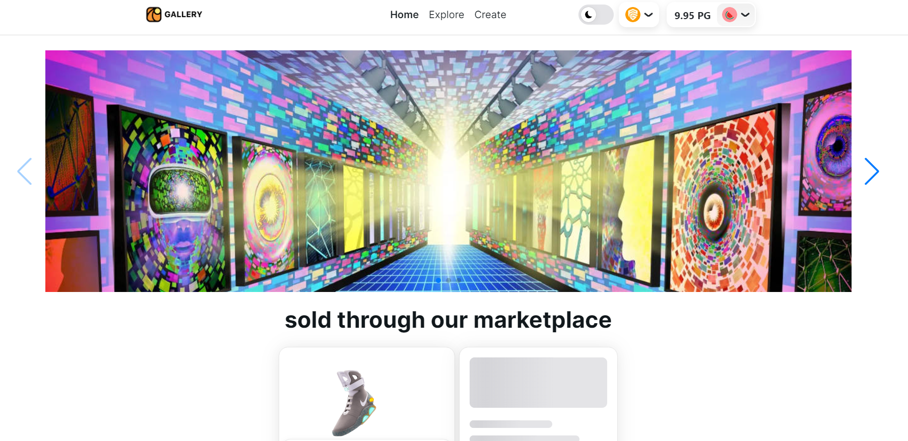

# Pego Gallery

# Vision

Content creators often face challenges related to ownership, authenticity and fair compensation for their work. Traditional platforms may limit their control over digital assets and provenance can be easily lost. Pego Gallery steps in to address these issues by providing a decentralized NFT marketplace.

# Description

Powered by Pego Network, Pego Gallery protects transparent and secure transactions for a wide array of non-fungible tokens. Connecting creators and collectors, the platform offers an artistic experience within the marketplace.
